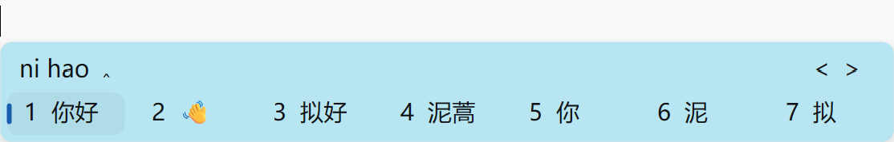

# Rime Weasel Fluent Theme

一套接近 Microsoft 拼音 Win11 候选窗布局的小狼毫主题.

支持 Windows 亮色与深色模式自动切换，并提供两种拼音预编辑显示方式。
## 亮色模式


> 本项目为个人制作的第三方主题，与 Microsoft、Rime 等无关。

## 特点

- 支持 Windows 亮暗模式自动切换
- 横向候选栏布局
- 针对横向 7 候选布局设计
- 支持彩色 Emoji 字体
- 无边框圆角候选框
- 提供候选框内、候选框外两种拼音显示方式

## 配置版本

### 拼音显示在候选框内

配置文件：[weasel-pinyin-inside.custom.yaml](weasel-pinyin-inside.custom.yaml)

拼音显示在小狼毫候选框第一行，候选词显示在第二行。

```yaml
"style/inline_preedit": false
```

### 拼音显示在候选框外

配置文件：[weasel-pinyin-outside.custom.yaml](weasel-pinyin-outside.custom.yaml)

拼音由当前应用显示，小狼毫候选框主要显示候选词。

```yaml
"style/inline_preedit": true
```

部分应用对行内预编辑的支持可能不同。如果出现首字母丢失或预编辑位置异常，建议使用候选框内版本。

## 安装方法

1. 下载本仓库，或者单独下载需要的 YAML 配置文件。
2. 备份原来的 `weasel.custom.yaml`。
3. 将选择的配置文件复制到小狼毫用户目录。
4. 将配置文件重命名为 `weasel.custom.yaml`。
5. 右键点击小狼毫托盘图标，选择“重新部署”。

常见的小狼毫用户目录：

```text
%APPDATA%\Rime
```

如果使用了自定义用户目录，请复制到实际的 Rime 用户目录中。

如果已有自己的 `weasel.custom.yaml`，请合并 `patch` 中的内容，不要直接覆盖已有的重要配置。

## 设置 7 个候选项

本项目的主题针对横向 7 候选布局设计，但候选数量属于输入方案设置，不由界面主题控制。

可以在当前输入方案的自定义配置中加入：

```yaml
patch:
  "menu/page_size": 7
```

例如使用薄荷输入法时，可以添加到对应的 `rime_mint.custom.yaml`，然后重新部署。

## 系统要求

- Windows 10 或 Windows 11
- 小狼毫输入法
- 推荐小狼毫 0.17.4 或更高版本
- Microsoft YaHei UI 字体
- Segoe UI Emoji 字体

## 项目范围

本项目只提供小狼毫界面主题，不包含以下内容：

- 词库或语言模型
- Lua 过滤器
- 输入长度限制
- 日期、时间或特殊符号功能
- 候选词排序和拼音识别规则
- 输入方案本身

## License

本项目采用 [MIT License](LICENSE)。
